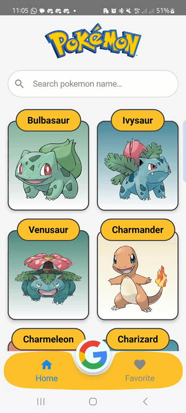
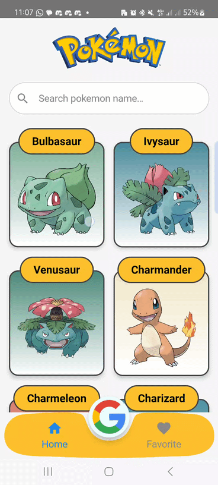
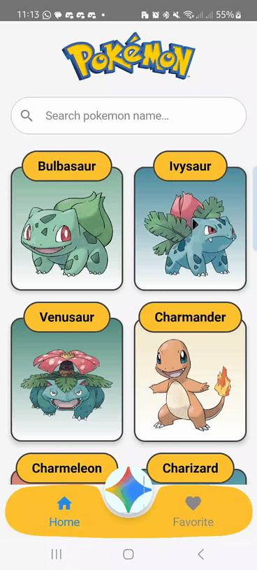
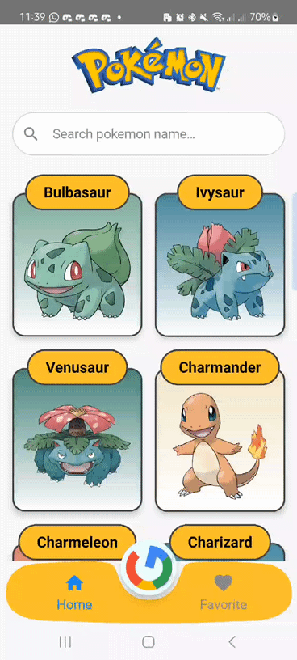

<div align="center">
  
  <br>
  <h1>PokedexAI</h1>
  Pokedex AI is a modern Android application designed to help you explore the world of Pokémon. This app not only provides comprehensive Pokémon data but also integrates an AI-powered chat feature using the Google Gemini AI to offer an interactive and informative experience.
  You can ask anything about the Pokémon universe—such as evolutions, stats, lore, or fun facts—and Gemini will provide insightful answers.
</div>

---

## 📽️ Demo
> **Want to try the app right now?** You can download the latest APK from the **[Releases](https://github.com/Alfiyansya/PokedexAI/releases)** page.
<div align="center">
    
    
    
    
</div>

---

## 🗝️ Key Features
The app comes with a complete set of features to meet the needs of every Pokémon trainer:


-   **Pokémon List**: Browse a comprehensive list of all Pokémon with an efficient and visually appealing layout that uses pagination to load data on demand, ensuring a smooth user experience.
-   **Pokémon Details**: View in-depth statistics, types, abilities, and other essential information for each Pokémon
-   **Quick Search:** Easily search for Pokémon by name or ID with a responsive interface.
-   **Gemini AI Chatbot:** Ask anything about the Pokémon universe. This feature is designed to answer your questions in depth, making your experience more interactive and educational.
-   **Favorite Pokémon:** Save your favorite Pokémon for quick access and offline viewing, leveraging **Room Database** for local data persistence.
-   **Modern UI:** A clean, intuitive user interface built with Material Design principles.

## 🛠️ Technologies Used

This application is built using the latest technologies and libraries in the Android ecosystem:

-   **Programming Language:** Kotlin
-   **Architecture:** Clean Architecture + Model-View-ViewModel (MVVM)
-   **UI Toolkit:** Jetpack Compose for building a declarative UI.
-   **State Management:** StateFlow and Coroutines
-   **Pagination:** Paging 3 Library for efficient data loading.
-   **Hilt:** For dependency injection.
-   **Retrofit & OkHttp:** For making API calls to the [PokeAPI](https://pokeapi.co/).
-   **Room:** To manage and persist the user's favorite Pokémon data.
-   **Gemini API:** For interactive chatbot integration.
-   **Coil:** For efficient image loading.

---

## ⚙️ How to Set Up and Run the Project

To run this project on your local machine, follow the steps below:

1.  **Clone the repository:**
    ```bash
    git clone https://github.com/Alfiyansya/PokedexAI.git
    ```

2.  **Open in Android Studio:**
    Open the cloned project using the latest version of Android Studio.

3.  **Get a Gemini API Key:**
    * Go to [Google AI Studio](https://aistudio.google.com/app/apikey).
    * Sign in with your Google account.
    * Click **"Create API key"** under the **"Get API key"** section.
    * Copy the generated API key. **Important: Make sure to copy your key now as you won't be able to see it again.**

4.  **Add the API Key to `local.properties`:**
    * In **Android Studio**, open the `local.properties` file located in your project's root directory.
    * Add the following line at the end of the file:
        ```properties
        API_KEY="PASTE_YOUR_API_KEY_HERE"
        ```
    * Replace `"PASTE_YOUR_KEY_HERE"` with the API key you just copied.

5.  **Sync the Project:**
    Wait for Gradle to finish syncing all dependencies. If it doesn't happen automatically, click the **Sync Project with Gradle Files** icon.

6.  **Run the App:**
    Select an emulator or physical device and press the **Run** ( ▶ ) button in Android Studio.

---

## Contributing

We welcome contributions from everyone! If you find a bug or have a feature suggestion, please open an **[Issue](https://github.com/Alfiyansya/PokedexAI/issues)**. If you want to contribute code, feel free to create a **[Pull Request](https://github.com/Alfiyansya/PokedexAI/pulls)**.

## License

This project is licensed under the **MIT License**. See the [LICENSE](LICENSE) file for more details.

## Contact

If you have any questions, feel free to contact the main developer:

-   [**Alfiyansya**](mailto:achmadalfiansyah069@gmail.com)
-   [GitHub](https://github.com/Alfiyansya)
-   [LinkedIn](https://linkedin.com/in/achmad-alfiansyah)
